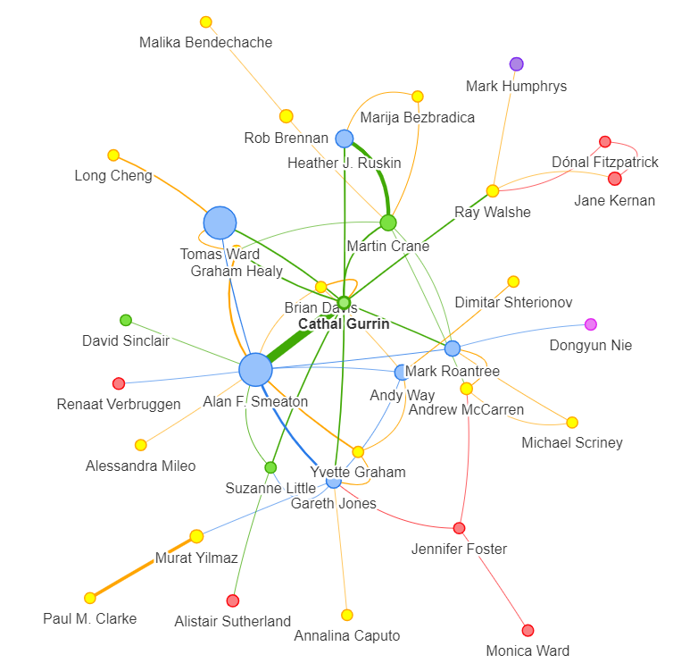
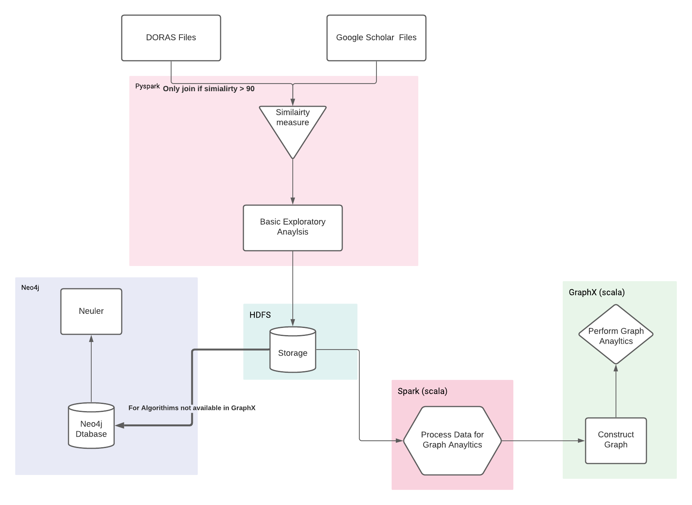

<h1 align="center">
  
   
  Citation Graph Analysis 
</h1>
<h3 align="center">
  Anthony Reidy, 18369643. Kian Sweeney, 18306226.
     
</h3>

## Table of Contents
- [Preamble](#preamble)
- [Report](#report)
- [Technologies Used](#technologies-used)
- [Video Link](#video-link)

## Preamble
An initial study of researcher relationships within DCU’s school of computing revealed little collaboration.  We intend to explore this observation further.  First, we plan to scrape faculty member’s Google Scholar and DORAS profiles  to  extract  additional  nuggets  of  information  using  the BeatuifulSoup and Selenium libraries on pySpark.  Next, we plan to explore our observation further by employing graph algorithms using GraphX.  Overall, we believe that the results generated from this investigation will be crucial for understanding research partnerships within DCU and we hope that DCU Academic search may provide avenues for cooperation, especially for early researchers who may not know the expertise of certain faculty members.

## Report
Our midway and final report can be found in the [reports](reports) folder. 

## Technologies Used

## Video Link
The link to the video showcasing us running the described technologies can be found [here](https://drive.google.com/drive/u/0/folders/1v81OPN7zrqRXe1KVx2XWd4sqBn140gYz).
